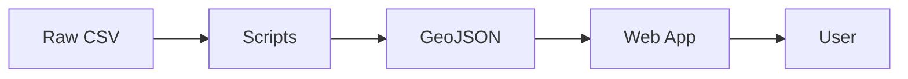

# Documentation Directory

This directory contains comprehensive technical documentation for the South Atlantic Cyclone Monitor project.

## 📚 Purpose

Centralized location for:
- Architecture decisions and design documents
- Data methodology and processing workflows
- Deployment procedures and DevOps guides
- API documentation
- User guides and tutorials
- Research notes and scientific context

## 📁 Planned Structure

```
docs/
├── architecture/           # System design and architecture
│   ├── overview.md         # High-level architecture
│   ├── data-flow.md        # Data pipeline architecture
│   └── component-diagram.md # Component relationships
├── decisions/              # Architecture Decision Records (ADRs)
│   ├── 001-next-js-framework.md
│   ├── 002-leaflet-mapping.md
│   └── template.md         # ADR template
├── deployment/             # Deployment and operations
│   ├── vercel-setup.md     # Vercel deployment guide
│   ├── environment-vars.md # Environment configuration
│   └── ci-cd.md            # Continuous integration setup
├── data/                   # Data documentation
│   ├── track-format.md     # Track data specification
│   ├── energetics.md       # Energetics parameters explained
│   └── data-sources.md     # Data provenance and sources
├── api/                    # API documentation
│   ├── endpoints.md        # API endpoint reference
│   └── data-models.md      # Request/response schemas
├── user-guide/             # End-user documentation
│   ├── getting-started.md  # Quick start guide
│   ├── filtering.md        # How to use filters
│   └── troubleshooting.md  # Common issues
└── README.md              # This file
```

## 🎯 Documentation Types

### Architecture Decision Records (ADRs)

Document significant technical decisions using the ADR format:

```markdown
# ADR 001: Use Next.js for Web Framework

**Status**: Accepted
**Date**: YYYY-MM-DD
**Deciders**: [Names]

## Context
We need a modern web framework for the cyclone monitor...

## Decision
We will use Next.js 14 with App Router...

## Consequences
**Positive:**
- Server-side rendering for better performance
- Built-in API routes
- Strong TypeScript support

**Negative:**
- Learning curve for team
- Vendor lock-in to Vercel ecosystem
```

### Data Documentation

Comprehensive explanation of:
- Track data structure and fields
- Energetics parameters and their meaning
- Quality control procedures
- Known limitations and caveats

### Deployment Guides

Step-by-step instructions for:
- Setting up Vercel deployment
- Configuring environment variables
- Managing secrets and credentials
- Monitoring and logging

### User Guides

Practical documentation for end users:
- How to access the monitor
- Filtering and searching tracks
- Interpreting visualizations
- Exporting data

## 📝 Writing Guidelines

### Markdown Standards

- Use clear, descriptive headings
- Include table of contents for long documents
- Use code blocks with language specification
- Add diagrams where helpful (Mermaid, ASCII art, or images)

### Example Document Template

```markdown
# Document Title

**Last Updated**: YYYY-MM-DD
**Author**: [Name]
**Status**: Draft | Review | Approved

## Overview
Brief summary of the document's purpose...

## Context
Background information and motivation...

## Details
Main content with subsections...

## Examples
Practical examples and code snippets...

## References
Links to related documents or external resources...
```

### Diagrams

Use Mermaid for inline diagrams:



## 🔄 Documentation Lifecycle

1. **Draft**: Initial version, work in progress
2. **Review**: Under team review
3. **Approved**: Finalized and official
4. **Deprecated**: Outdated, kept for reference

Mark document status clearly in the frontmatter.

## 📊 Key Documents to Create (Future)

### High Priority
- [ ] `architecture/overview.md` - System architecture
- [ ] `data/track-format.md` - Track data specification
- [ ] `decisions/001-technology-stack.md` - Tech stack rationale
- [ ] `deployment/vercel-setup.md` - Deployment instructions

### Medium Priority
- [ ] `user-guide/getting-started.md` - User onboarding
- [ ] `data/energetics.md` - Energetics explanation
- [ ] `api/endpoints.md` - API reference

### Lower Priority
- [ ] `architecture/component-diagram.md` - Detailed components
- [ ] `user-guide/troubleshooting.md` - FAQ and issues
- [ ] `data/data-sources.md` - Data provenance

## 🔗 External References

Link to external resources:
- [Next.js Documentation](https://nextjs.org/docs)
- [Leaflet Docs](https://leafletjs.com/)
- [GeoJSON Specification](https://geojson.org/)
- [Vercel Deployment Guide](https://vercel.com/docs)

## 📖 Scientific Context

For research-related documentation:
- **Cyclone Climatology**: Background on South Atlantic cyclone characteristics
- **Energy Cycle Theory**: Lorenz Energy Cycle framework
- **Tracking Methodology**: How tracks were identified and processed
- **Validation Studies**: Comparison with previous research

## 🔍 Searchability

Keep documentation:
- Well-organized by topic
- Cross-referenced with links
- Searchable via keywords
- Versioned alongside code

## 📧 Contributing to Docs

When adding documentation:
1. Follow the directory structure
2. Use the appropriate template
3. Include date and author
4. Link from relevant READMEs
5. Keep it up-to-date with code changes

## 📧 Questions?

For documentation standards and best practices, refer to the repository's main README or contact the research team.
